# DON'T STEP IN THE POOP

## Introduction

This project has been developed as part of the [Code Institute's](https://codeinstitute.net/) Diploma in Full-Stack Software Development.  The aim is to create a command line app that will demonstrate the skills I have learnt in the Python programming language. 

This command line app is a fun little game of chance.  The aim of the game is not disimiliar to Battleships - where you guess co-ordinates in a grid to sink your opponents ships - however, in this game you need to guess co-ordinates to make a clear path across the 'garden' without stepping in a dog poo. 

[Link to deployed site here](https://dont-step-in-the-poop.herokuapp.com/)

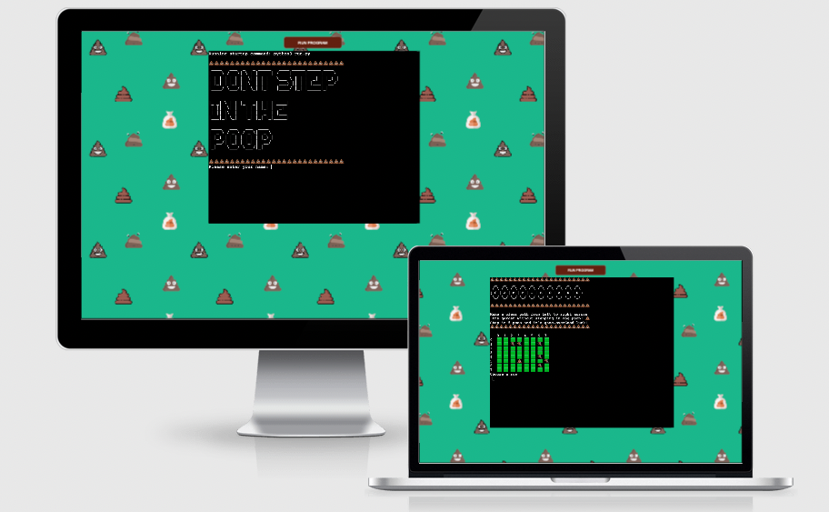

## How To Play

The rules of the game are simple.  Make a horizontal path through the 'garden' (gameboard) without discovering a poo.  

The gameboard is made up of 8 rows and 8 columns and each space on the board is represented with a green tile.  There are 13 poos randomly distributed across the garden and only one row where no poos have landed.  

Select a row, and then a column to start guessing.   If you discover a poo, the green tile will be replaced with a poo emoji.  If you choose a coordinate which has no poo on it, the green tile will be replaced with a boot. 

Can you find the clear path through the garden by stepping on 5 poos or less?  Step on 5 poos and I'm afraid it's game over, and you need to go home and clean those boots... or just play again!

## UX 

### Site Goals

The site's aims are to:
* Provide the user with a fun and simple game of chance. 
* Provide clear instructions on how to play the game.
* Provide an appropriate response to all user inputs and handle invalid data accordingly.
* Provide an enjoyable experience to the user.

### User Stories

As a user I want:
* To play a fun and simple game of chance. 
* The purpose and the rules of the game to be apparent.
* To know that my input is valid.

### Features 

#### Main Page and Welcome Screen

In order to give the user insight into the nature of the game, I designed the welcome page to show the name of the game (which in itself is self-explanatory) styled using [FIGlet fonts](http://www.figlet.org/examples.html)  and set the background of the browser to an image created using [flaticon](https://www.flaticon.com/), to fit with the theme - lots of poos on a green background.  On the main screen the user is asked to enter their name so a personalised greeting can be created.

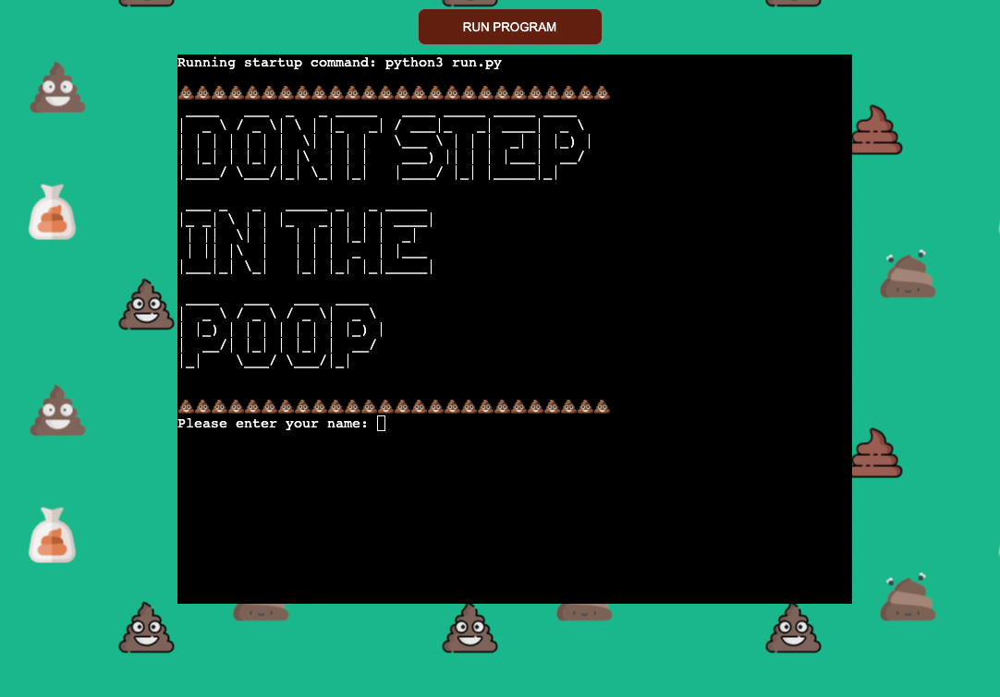

 

#### Story and Rules

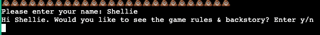

For first-time users of the game, I thought it would be appropriate to have the option to view the rules and backstory of the game.  The backstory gives the game some context and adds an element 'fun'.

For returning users who may not wish to view the rules, they can simple answer 'n' to this question.

By answering 'y' at this point, the player will be taken to the Story screen.  There is then an option to press enter to continue, which gives the player as much time as they need to read the story.

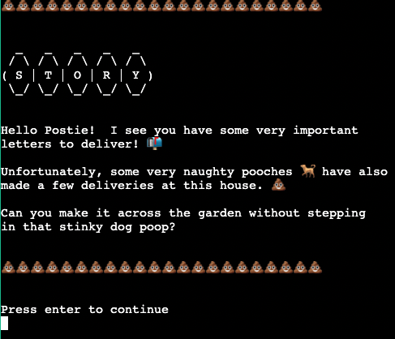

When the player presses 'Enter' the terminal is cleared and the rules are displayed in a consistent styling to the story screen to avoid too much screen movement.

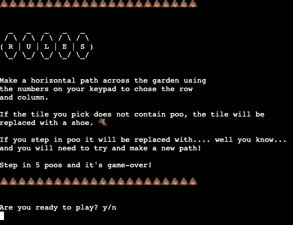

Once the rules are displayed or the user selects that they do not wish to view the rules, they will be asked if they are ready to play. 

All input is validated to check that the answer is either 'y' or 'n' and if not the below error will be shown:-

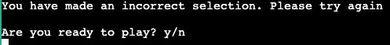

It was important to include data validation for all inputs as it is incredibly frustrating and does not provide a good user experience if the game ends because of incorrect data entry.  This would result in the user having to restart the program from the beginning, potentially discouraging the user from playing. 

If the user selects that they are ready to play, they will be taken to the game-board, where the game will begin.

#### Game-board 
 The game-board screen displays a heading 'Game-board' using figlet font 'bubble' which has a top and bottom border of emoji poos to give it shape and color.  There is a brief overview of the rules and then the game-board.  The game-board consists of 8 rows and 8 colums, with each space represented as a green tile.  This is to create the effect of a garden to fit with the story of the game.  The user is then tasked to guess a row, followed by a column to make their first guess or step across the garden.  

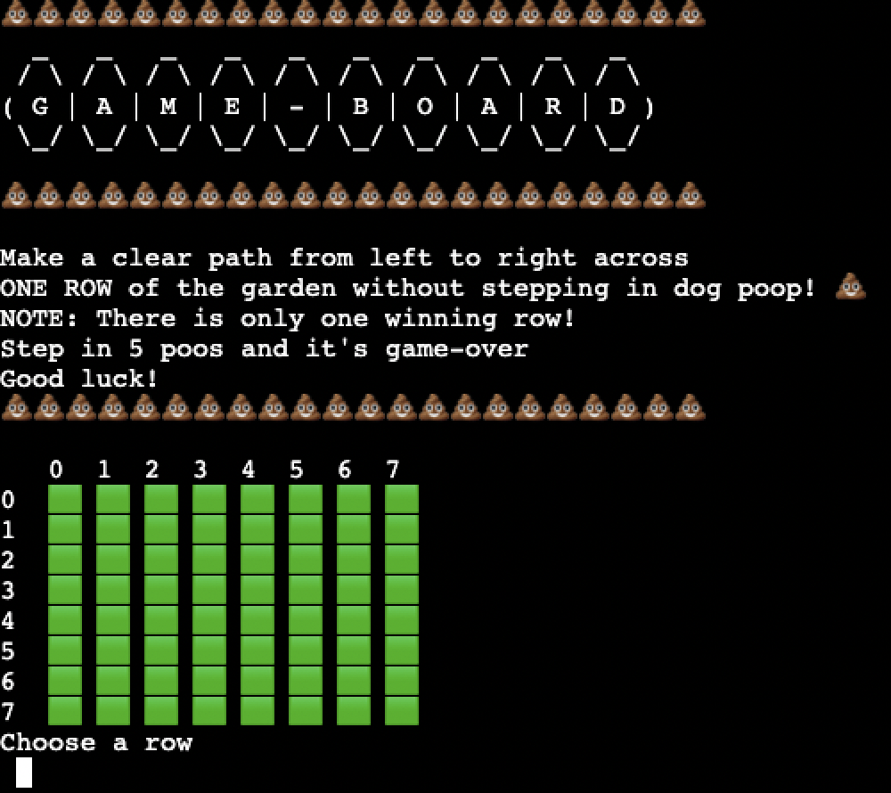

As the user progresses through the game and continues to make guesses, the green tiles update to show either a poo emoji if a poo is found or a shoe emoji if there is no poo on the path.   It also shows the amount of poos already stepped in to let the user know how many more incorrect guesses they can make.  The game is over when 5 poos are stepped in. 

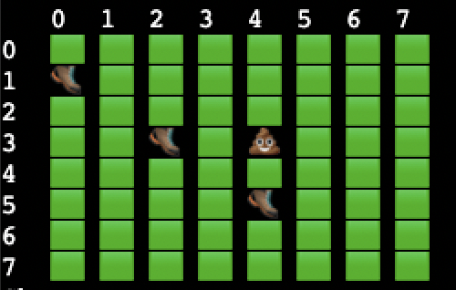

A message is displayed to the player after each guess, letting them know if they have stepped in a poo or a clear path.   

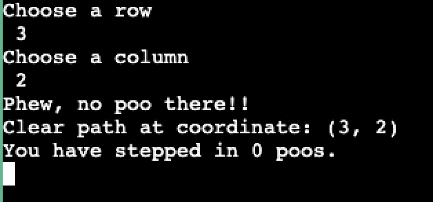
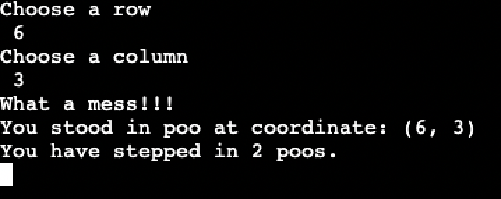

I decided to use emojis for the game board to provide a bit of shape and color to the game and provide a more pleasing user experience. 

### Structure Plane

* User Story: / Acceptance Criteria:

### Skeleton Plane

#### Logic Flow

### Surface Plane

#### Design

Poop Ascii Art from user [pr0p3rno0b10](https://replit.com/@pr0p3rno0b10/poop-emoji-ascii-art) on Replit.

Smiley face ASCII are from [loveascii.com](http://loveascii.com/smilies.html)

#### Features 

* Welcome Screen

### Future Development

Whilst I am happy with the functionality and simplicity of the app in it's current state, there are a number of features I would like to implement in the future.  

I would like introduce varying levels of difficulty, which could be done in a number of ways:

1. Reducing or increasing the number of rows and columns on the game board;
2. Reducing or increasing the number of poos to avoid;
3. Reducing or increasing the number of poos allowed to be stepped in before the game is declared as lost.

As the board is created as a class, I think the above would be fairly simple options to add by creating a new user input to select the difficulty level - easy, medium or hard - and passing the appropriate arguments for the number of rows/columns, number of poos and number of lives.

In it's current state, the user is only able to win the game by finding a clear path horizontally through the board.  I would also like to develop the game further so that the user can create a straight path either horizontally, vertically or diagonally through the board.  Unfortunately this was out of scope for this project due to the limited time-frame I was working within, but I think that adding this functionality would provide a better user experience.

### Testing
 

#### Manual Testing 
Testing took place continuously throughout the development of the app.  Functions were tested using print statements as and when they were created and the functionality was tested regularly in the IDE to ensure the outcome of those functions was as expected.  I used the linter recommended by CI (flake8) to identify any problems within the code and rectified these as soon as they were brought to my attention.  In the instance that functions did not work as expected, I use the integrated debugger tool within Gitpod to see step by step exactly what was happening  to enable me to make appropriate changes.

All inputs have been tested for the following to ensure data validation is working as expected:-

* Where a 'y' or 'n' is accepted as input I have tested with other string combinations, such as other letters or numbers, symbols and no input.  No issues were uncovered here and the input validation was working as expected. 

* Where an integer between 0 and 8 (not including 8) is expected, I have tested using a strings, numbers greater than 7, letters, symbols and no input.  An issue was identified and fixed here and this is discussed in further details in the 'Issues' section. 

The app was deployed early on Heroku so I could see the final output as this differs from what is seen when running the program in the IDE.  This meant I was able to make changes to the styling as I went along to ensure the best user experience possible was achieved.  

Once the game was 'finished' I submitted it for peer review in the Code Institue Slack Community.  A few small issues were brought to my attention, which were noted and tweaked and again, are discussed in further details in the 'Issues' section. 

#### Issues

#### PEP8 Online Validation

PEP8 Online Results for run.py file 

 

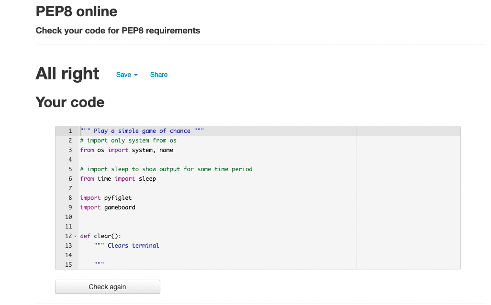

 

PEP8 Online Results for gameboard.py file

 

 

### Libraries Used

### Deployment

This app has been deployed via [Heroku](https://www.heroku.com/) and the live link can be found here: PUT LINK HERE!!! 

The following steps were followed to deploy to Heroku:

1. Visit [Heroku](https://www.heroku.com/) and log-in or create a new account.
2. Click the 'New' button.
3. Select the option to 'Create new app'.
4. Give the app a unique name.  Heroku will advise you if the name is available or not.  The unique name for this app is dont-step-in-the-poop.  Names should consist of only lower-case letters, numbers and dashes.
5. Select the appropriate region.
6. Click 'Create App'.  This will create your app in Heroku and take you to the app dashboard. 
7. Navigate to the settings tab and scroll down to 'Config vars'.  For KEY enter PORT and VALUE enter 8000.  Click the 'Add' button
8. Scroll down to 'Buildpacks' and click the 'Add Buildpack' button.  Firstly select 'python' and save changes.  Repeat, this time selecting 'node.js' and saving changes.  Make sure your buildpacks show in the correct order once selected, with Python being first in the list and node.js second.  If they are not in the correct order, you can drag and drop as required.
9. Use the menu at the top of the page to navigate to the 'Deploy' tab.
10. Select Github as the deployment method and then confirm you want to connect to Github by pressing the 'Connect to Github' button. 
11. Search for the Github Repository using the search field and click 'Search'. 
12. Click 'Connect' next to the correct Github repository. 
13. Once your repsitory is connected to Heroku, you can enable automatic deploys using the 'Enable Automatic Deploys' button or manually deploy  by selecting the branch to deploy following by the 'Deploy Branch' button. 
14.  If you choose to automatic deploys, Heroku will build a new version of the app whenever a change is pushed to Github.  Manually deploys allows you to update the app whenever you click the 'Deploy Branch'.   For this project I enabled automatic deploys to ensure the app was updated each time changes were pushed to Github.
15. When the build process is complete you will be able to view the live app by clicking the link 'Your app was successfullly deployed".
